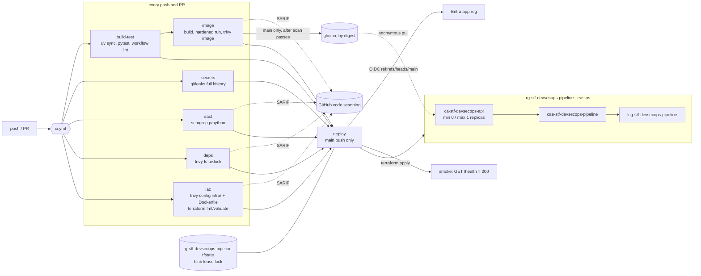

# Plan: DevSecOps Pipeline

> seq: 001 · devsecops-pipeline · 2026-09-25 · inputs: spec.md (clarified), research.md, D-001…D-009

## 1. Architecture
<!-- Source: spec.md#US1, spec.md#US2, spec.md#US3, spec.md#FR-009 -->



- **PRs** run every gate and upload SARIF, but never reach Azure or GHCR (D-006). Merges into `main` require
  `build-test` plus every gate check (FR-014).
- **A push to `main`** re-runs every gate. The image is pushed only after its scan passes. `deploy` runs only when every job it `needs` has succeeded, then
  applies Terraform with the new digest and runs the smoke test (FR-009, FR-010, FR-017, D-003).

## 2. Components and repo paths
<!-- Source: spec.md#FR-001, spec.md#FR-002, spec.md#FR-008, spec.md#FR-016 -->

| Path | Component | Delivered by |
|---|---|---|
| `app/__init__.py`, `app/main.py` | FastAPI app: `GET /health` → `{"status":"ok"}`; `GET /api/v1/greeting?name=` → `{"message":"Hello, <name>"}`, `name` 1–64 chars, 422 otherwise | `uv run uvicorn app.main:app` |
| `tests/test_health.py`, `tests/test_greeting.py` | unit tests via FastAPI `TestClient` | `uv run pytest` |
| `pyproject.toml`, `uv.lock`, `.python-version` | project metadata, locked deps, Python 3.12 | `uv sync --locked` |
| `Dockerfile`, `.dockerignore` | multi-stage uv build → `python:3.12-slim-trixie` runtime, `USER 10001`, port 8000 | `docker build .` |
| `.github/workflows/ci.yml` | pipeline (section 3) | GitHub Actions |
| `.github/workflows/secrets.yml` | reusable gitleaks workflow (`workflow_call`, `workflow_dispatch`, weekly `schedule`) | called by `ci.yml` |
| `.github/dependabot.yml` | ecosystems `uv`, `github-actions`, `docker` (weekly) | Dependabot |
| `.trivyignore` | justified suppressions only (each line: ID + `# reason, expiry`) | read by Trivy |
| `infra/versions.tf`, `infra/backend.tf`, `infra/main.tf`, `infra/variables.tf`, `infra/outputs.tf`, `infra/.terraform.lock.hcl` | Terraform (section 4) | `terraform -chdir=infra …` |
| `scripts/bootstrap-azure.sh` | one-time owner setup: RGs, state storage, app registration, federated credential, role assignments, GitHub variables | run locally with `az` + `gh` |
| `scripts/protect-main.sh` | branch protection with required checks | `gh api` (run locally) |
| `scripts/teardown.sh` | destroy the stack (and optionally the state RG + app registration) | `make teardown` |
| `scripts/verify-sc.sh` | runs the SC-001…SC-009 checks and prints pass/fail | `make verify` |
| `Makefile` | `setup`, `gitleaks` (existing), `test`, `scan` (local containers), `teardown`, `verify` | `make` |
| `README.md` | setup, gate table, demo guide, platform exception, cost, teardown | docs |

## 3. Pipeline (`.github/workflows/ci.yml`)
<!-- Source: spec.md#FR-002, spec.md#FR-003, spec.md#FR-004, spec.md#FR-005, spec.md#FR-006, spec.md#FR-007, spec.md#FR-009, spec.md#FR-010, spec.md#FR-012, spec.md#FR-013, spec.md#FR-017 -->

**Triggers:** `push` to `main` and `pull_request` into `main`, with no path filters. A workflow skipped by path filters leaves
required checks pending (research.md R-14).

**Top-level settings:**
- `permissions: contents: read`, with each job widening only what it needs.
- `concurrency: ci-${{ github.ref }}`. Deploy uses its own non-cancelling group `deploy-main`.
- One source for the blocking severity (FR-012, D-002):
  ```yaml
  env:
    BLOCKING_SEVERITY: HIGH,CRITICAL        # Trivy
    SEMGREP_BLOCKING_SEVERITY: ERROR        # Semgrep ERROR == High (research.md R-05)
  ```
- Scanner images are pinned by digest in env vars `TRIVY_IMAGE`, `SEMGREP_IMAGE` and `GITLEAKS_IMAGE` (D-004). Every `run:` step
  starts with `set -euo pipefail`.

| Job | Permissions | Steps (all fail closed) |
|---|---|---|
| `build-test` | `contents: read` | 1. `checkout`. 2. Install uv (pinned). 3. `uv sync --locked`. 4. `uv run pytest`. 5. **Workflow lint:** fail if `.github/workflows/` contains `continue-on-error` or `\|\| true` (FR-013, SC-004). |
| `secrets` | `contents: read` | `uses: ./.github/workflows/secrets.yml` → gitleaks full history, `--redact` (FR-003) |
| `sast` | `contents: read`, `security-events: write` | 1. **Report:** `semgrep scan --config p/python --sarif-output semgrep.sarif`. 2. Upload SARIF (`if: always()`, category `semgrep`). 3. **Gate:** `semgrep scan --config p/python --severity $SEMGREP_BLOCKING_SEVERITY --error` (FR-004) |
| `deps` | `contents: read`, `security-events: write` | 1. **Report:** `trivy fs --format sarif` on repo root (`uv.lock`). 2. Upload (`category: trivy-fs`). 3. **Gate:** `trivy fs --severity $BLOCKING_SEVERITY --ignore-unfixed --exit-code 1` (FR-005) |
| `iac` | `contents: read`, `security-events: write` | 1. `terraform fmt -check -recursive infra`. 2. `terraform -chdir=infra init -backend=false` + `validate`. 3. **Report:** `trivy config` SARIF over `infra/` and `Dockerfile`. 4. Upload (`category: trivy-config`). 5. **Gate:** `trivy config --severity $BLOCKING_SEVERITY --exit-code 1 .` (FR-007) |
| `image` | `contents: read`, `security-events: write`, `packages: write` | `needs: build-test`. 1. Buildx build, `load: true`, tag `local/api:${{ github.sha }}`. 2. **Hardened run:** `docker run -d --read-only --tmpfs /tmp --cap-drop ALL --security-opt no-new-privileges --user 10001 -p 8000:8000`, then `curl --retry` `/health` = 200 (D-007). 3. Assert image user ≠ root (`docker inspect -f '{{.Config.User}}'`). 4. **Report:** `trivy image` SARIF, uploaded (`category: trivy-image`). 5. **Gate:** `trivy image --severity $BLOCKING_SEVERITY --ignore-unfixed --exit-code 1`. 6. **Only if** `push` to `main`: login to GHCR with `GITHUB_TOKEN`, push, emit the `digest` output (FR-006, D-003) |
| `deploy` | `contents: read`, `id-token: write` | `needs: [build-test, secrets, sast, deps, iac, image]`, `if: github.event_name == 'push' && github.ref == 'refs/heads/main'`. 1. `azure/login` (OIDC; vars `AZURE_CLIENT_ID`/`AZURE_TENANT_ID`/`AZURE_SUBSCRIPTION_ID`). 2. `setup-terraform` 1.16.4. 3. `terraform init` (backend via `-backend-config` from vars). 4. `terraform apply -auto-approve -var image=ghcr.io/cjsy2001/devsecops-pipeline@<digest>`. 5. **Smoke:** read the `fqdn` output, `curl` `/health` with retries for ≤ 120 s (cold start), fail on non-200 (FR-009, FR-010) |

**Action pins (NFR-002):**
- `actions/checkout@v7` and `github/codeql-action/upload-sarif@v4` are GitHub-owned, so major tags.
- `azure/login`, `hashicorp/setup-terraform`, `docker/setup-buildx-action`, `docker/login-action`, `docker/build-push-action` and `astral-sh/setup-uv` are pinned to full commit SHAs with a `# vX.Y.Z` comment. Dependabot `github-actions` keeps them current.

**Assumption A-112:** `astral-sh/setup-uv` is the uv installer action; the alternative is `COPY`ing uv from its image. Its SHA is resolved in Setup.

## 4. Azure resources (`infra/`)
<!-- Source: spec.md#FR-008, spec.md#FR-015, spec.md#NFR-004, spec.md#NFR-006 -->

**Created by `scripts/bootstrap-azure.sh`** (owner, once). These are outside Terraform because CI has no subscription-scope rights:

| Resource | Name | Notes |
|---|---|---|
| Resource group | `rg-stf-devsecops-pipeline` (eastus) | the app stack. CI gets Contributor here only |
| Resource group | `rg-stf-devsecops-pipeline-tfstate` (eastus) | state only; survives app teardown |
| Storage account | `ststfdevsecops<4 random>` | StorageV2 Standard_LRS, `--min-tls-version TLS1_2`, `--allow-blob-public-access false`, `--allow-shared-key-access false` |
| Blob container | `tfstate` | CI gets Storage Blob Data Contributor on this container only |
| Entra app registration + SP | `sp-stf-devsecops-pipeline-ci` | one federated credential, subject `repo:cjsy2001/devsecops-pipeline:ref:refs/heads/main` (D-006) |
| GitHub Actions **variables** | `AZURE_CLIENT_ID`, `AZURE_TENANT_ID`, `AZURE_SUBSCRIPTION_ID`, `TFSTATE_RG`, `TFSTATE_ACCOUNT` | set with `gh variable set`. These are identifiers, not credentials, and they never appear in git (D-001) |

Every bootstrap resource gets the tags `project=devsecops-pipeline spec=001-devsecops-pipeline owner=cjsy2001`.

**Managed by Terraform** (`azurerm ~> 5.7`, `required_version >= 1.6, < 2.0`):

| Resource | Name | Settings |
|---|---|---|
| `data.azurerm_resource_group` | `rg-stf-devsecops-pipeline` | existing |
| `azurerm_log_analytics_workspace` | `log-stf-devsecops-pipeline` | `PerGB2018`, `retention_in_days = 30`, `daily_quota_gb = 0.1` (D-009, A-106) |
| `azurerm_container_app_environment` | `cae-stf-devsecops-pipeline` | consumption; `logs_destination = "log-analytics"` |
| `azurerm_container_app` | `ca-stf-devsecops-api` | `revision_mode = "Single"`, container `api`, `image = var.image`, cpu 0.25, memory `0.5Gi`, `min_replicas = 0`, `max_replicas = 1`, ingress external, `target_port = 8000`, `allow_insecure_connections = false`, liveness/readiness probe `GET /health`. No `registry` block (public GHCR, A-107) |

- **Backend:** `backend "azurerm" {}` with `use_oidc = true` and `use_azuread_auth = true`. `storage_account_name`, `container_name = "tfstate"` and
  `key = "001-devsecops-pipeline.tfstate"` are passed via `-backend-config` (R-11).
- **Tags:** `locals.tags = { project = "devsecops-pipeline", spec = "001-devsecops-pipeline", owner = var.owner }`, applied to every resource.
- **Outputs:** `fqdn` (the app's latest revision FQDN) and `resource_group`.

**Idle-month cost** (research.md R-15): **≈ $0.01/month**, against the NFR-004 target of < $5.

- **Container App:** $0. It scales to zero, and requests fall inside the free grant.
- **Log Analytics:** $0, under 5 GB.
- **State storage:** under $0.01.
- **GHCR:** $0.

A-110 and A-111 are checked against the first month's cost analysis.

## 5. Security controls
<!-- Source: spec.md#NFR-001, spec.md#NFR-002, spec.md#NFR-003, spec.md#FR-013, spec.md#FR-014, .claude/rules/security.md, .claude/rules/azure.md -->

| Control | Implementation | Verified by |
|---|---|---|
| No stored cloud credentials | OIDC only, and the federated subject is `main`. No client secret or publish profile exists | SC-006; `gh secret list` shows no Azure secret |
| PRs can't reach cloud | no `pull_request` federated credential; `deploy` gated by `if:` and `id-token: write` only on `deploy` | review of `ci.yml`; the demo PRs show `deploy` skipped |
| Least-privilege RBAC | Contributor at the app RG scope, plus blob data on the state container | SC-006 |
| Fail closed | explicit `--exit-code 1` / `--error`; `set -euo pipefail`; no `continue-on-error`, no `\|\| true` (lint in `build-test`) | SC-004, SC-009 |
| Immutable supply chain | scanner images by digest, third-party actions by SHA, base image by tag (digest for the deployed build), `uv.lock`, `.terraform.lock.hcl`, Dependabot | `iac`/`deps` gates; review |
| Least-privilege container | numeric non-root `USER 10001`; hardened local run (`--read-only --cap-drop ALL --security-opt no-new-privileges`) | `image` job steps 2–3 |
| **Platform exception** (D-007) | Azure Container Apps can't enforce a read-only rootfs, dropped capabilities or runAsNonRoot (research.md R-09). The image is proven to run under those constraints in CI, and the README records the gap | `image` job; README section |
| Secrets hygiene | gitleaks pre-commit hook + `secrets` job (full history); `.gitignore` covers `.env`, `*.tfstate`, `*.tfvars` | SC-005 |
| State protection | state RG separate; storage with shared keys disabled, TLS 1.2, no public blob access; blob-lease locking | bootstrap script review; `az storage account show` |
| Branch protection | PR required; required checks = `build-test`, `secrets / gitleaks` (A-109), `sast`, `deps`, `iac`, `image`; **not** `deploy` (D-008) | SC-007 |

## 6. Demo defects (FR-011)
<!-- Source: spec.md#FR-011, spec.md#US2, spec.md#US4 -->

Each defect lives only on its `demo/*` branch with an open, never-merged PR. `main` never contains the defect, so the
`secrets` job on `main` stays clean (SC-005).

| Branch | Defect (exactly one gate fails) | Expected failing check |
|---|---|---|
| `demo/secrets` | a file holding an obviously fake credential that matches a gitleaks rule, e.g. an AWS-style key using the documented example value, commented `FAKE: demo only` | `secrets / gitleaks` |
| `demo/sast` | a new endpoint that shells out with `subprocess.run(..., shell=True)` on a query parameter | `sast` |
| `demo/deps` | a dependency downgraded to a version with a fixed HIGH/CRITICAL CVE, relocked in `uv.lock` | `deps` |
| `demo/image` | runtime base swapped to an old, EOL tag with fixed HIGH/CRITICAL OS vulnerabilities | `image` (the IaC gate must still pass, so the Dockerfile keeps `USER`) |
| `demo/iac` | `allow_insecure_connections = true` on the Container App ingress, or another single HIGH misconfiguration Trivy flags | `iac` |
| `demo/scanner-error` | a Semgrep config pointing at a non-existent rules file | `sast` fails with Semgrep's error exit code (SC-009, US4) |

**Assumption A-113:** each concrete defect trips *only* its gate at HIGH+. Each demo task confirms this with a local
container scan before opening the PR, and swaps the defect if a different gate also fires or nothing fires.

## 7. Test strategy
<!-- Source: spec.md#Success Criteria -->

| Layer | What | Command |
|---|---|---|
| Unit | `/health` 200; greeting OK; greeting 422 on empty or >64-char names | `uv run pytest` |
| Container | image runs under the full least-privilege profile; user ≠ root | `image` job (and `make scan` locally) |
| Gates (positive) | each gate passes on clean `main` | `gh run list --branch main` (SC-001) |
| Gates (negative) | each gate blocks its demo defect; deploy skipped | `gh pr checks <demo PR>` × 5 (SC-002) |
| Fail closed | a scanner error fails the job | `demo/scanner-error` PR (SC-009); workflow lint (SC-004) |
| IaC | fmt, validate, plan (on `main` only) | `iac` job, `deploy` job |
| Deploy | `/health` = 200 on the live FQDN | `deploy` smoke step; SC-003 |
| Posture | RBAC scope, branch protection, history clean, teardown | `scripts/verify-sc.sh` (SC-005…SC-008) |

## 8. Phases
<!-- Source: spec.md#User Scenarios -->

1. **Setup:**
   - Install Terraform 1.16.4 locally (the local 0.13.7 is too old).
   - Resolve the digests for the Trivy, Semgrep, gitleaks, Python and uv images (A-101).
   - Resolve the SHAs for the third-party actions.
2. **Foundational:**
   - App, tests, `pyproject.toml`/`uv.lock`, Dockerfile, `.dockerignore`.
   - `Makefile` targets.
   - The `ci.yml` skeleton with `build-test` plus the workflow lint.
   - `secrets.yml` converted to a reusable workflow.
3. **US1 (every push scanned):** the `sast`, `deps`, `iac` and `image` jobs, SARIF upload and `dependabot.yml`.
4. **US2 (vulnerable change blocked):** `scripts/protect-main.sh`, required checks (after reading the real check names, A-109) and the five demo branches and PRs.
5. **US3 (green main deploys):**
   - `scripts/bootstrap-azure.sh` and the `infra/` Terraform with its lockfile.
   - The `deploy` job with the smoke test.
   - Make the GHCR package public (A-108).
   - First deploy.
6. **US4 (fail closed):** the `demo/scanner-error` PR; confirm the workflow lint catches an injected `continue-on-error`.
7. **US5 (cheap and disposable):** `scripts/teardown.sh` and `make teardown`, the cost section, and a teardown → re-deploy rehearsal (SC-008).
8. **Polish:**
   - README.
   - `scripts/verify-sc.sh`.
   - Try the narrower Container Apps roles (D-006 follow-up).
   - Final `make gitleaks`.

## 9. FR coverage checklist
<!-- Source: spec.md#Functional Requirements -->

| FR | Plan section |
|---|---|
| FR-001 | §2 app + tests |
| FR-002 | §3 `build-test` |
| FR-003 | §3 `secrets`; §5 secrets hygiene |
| FR-004 | §3 `sast` |
| FR-005 | §3 `deps`; §2 `dependabot.yml` |
| FR-006 | §2 Dockerfile; §3 `image` |
| FR-007 | §3 `iac` |
| FR-008 | §4 Terraform + backend |
| FR-009 | §3 `deploy`; §4 bootstrap identity; §5 |
| FR-010 | §3 `deploy` smoke step |
| FR-011 | §6 demo defects |
| FR-012 | §3 `BLOCKING_SEVERITY` env |
| FR-013 | §3 fail-closed steps + lint; §5 |
| FR-014 | §5 branch protection; §2 `protect-main.sh` |
| FR-015 | §4 RG, names, tags |
| FR-016 | §2 README; §8 Polish |
| FR-017 | §1 flow; §3 `deploy` trigger |

**Other checks:**
- NFR-001…006 are covered in §4 and §5.
- No data entities were invented (the spec has none).
- Every output names its delivery: a command, a workflow job, a script or a Terraform resource.
